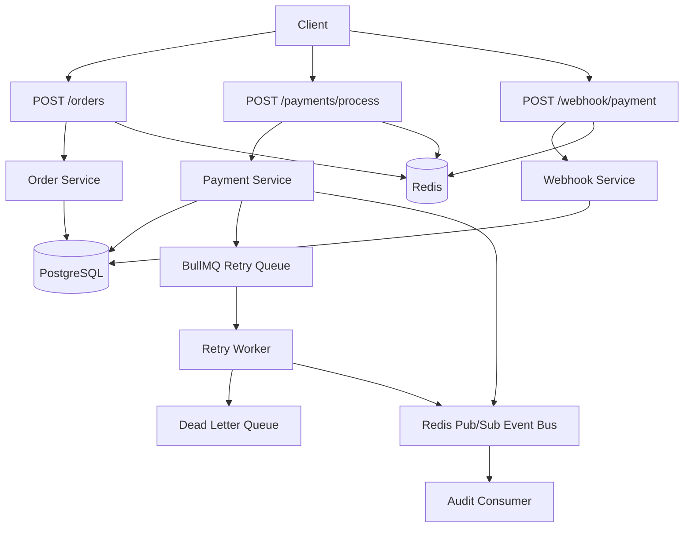

# Payment Microservice

A production-grade Node.js payment microservice that demonstrates real-world backend system design — order lifecycle management, simulated payment processing, secure webhook ingestion, request idempotency, retry queues with exponential backoff, dead-letter recovery, audit logging, and event-driven architecture via Redis pub/sub.

> **Note:** This is not a gateway SDK wrapper. It is a standalone backend service that _simulates_ the server-side behavior of a payment gateway (inspired by Razorpay / Stripe), built to showcase distributed-systems patterns that matter in production.

---

## Tech Stack

| Layer | Technology |
|---|---|
| Runtime | Node.js 20 |
| Framework | Express 5 |
| Database | PostgreSQL 16 |
| Cache / Pub-Sub | Redis 7 |
| Task Queue | BullMQ |
| Validation | Zod |
| Logging | Pino |
| Testing | Jest + Supertest |
| Containerization | Docker + Docker Compose |

---

## What It Demonstrates

- **Order creation** — `POST /orders` creates a payment intent with `pending` status
- **Payment simulation** — `POST /payments/process` simulates success, failure, and timeout outcomes
- **Webhook ingestion** — `POST /webhook/payment` with HMAC signature verification and replay protection
- **Idempotency** — Redis-backed idempotency keys prevent duplicate orders and transactions
- **Retry + backoff** — BullMQ retry queue with bounded exponential backoff (1s → 5s → 15s)
- **Dead Letter Queue** — permanently failed jobs are captured for inspection and reprocessing
- **Audit logging** — immutable `payment_logs` table tracks every lifecycle event
- **Event-driven design** — Redis pub/sub event bus with a versioned envelope and idempotent consumers

---

## Architecture



---

## Payment Flow

1. A client creates an order via `POST /orders` — an intent is persisted with `status = pending`.
2. The client submits payment simulation data via `POST /payments/process` (success / failure / timeout).
3. The service records a transaction, updates the order status, logs the lifecycle event, and publishes a domain event.
4. Failed or timed-out attempts are pushed to a BullMQ retry queue with exponential backoff.
5. If retries are exhausted, the job is routed to the Dead Letter Queue for inspection or manual reprocessing.
6. External webhooks are verified with HMAC-SHA256, deduplicated by event ID, and applied idempotently to the order state.

---

## System Design Decisions

### Idempotency

Protected write endpoints require an `Idempotency-Key` header:

- `POST /orders`
- `POST /payments/process`

How it works:

- The request key is stored in Redis with a cached response snapshot.
- Repeating the same key with the same payload returns the original response.
- Reusing the same key with different payload data is treated as a collision and rejected.
- In-progress duplicate requests wait for the original request to finish — no duplicate side effects.
- Keys expire automatically using the configured TTL.

**Why this matters:** In payment systems, network retries and flaky clients are inevitable. Idempotency ensures that a retry never results in a duplicate charge or duplicate order.

### Webhook Security

`POST /webhook/payment` accepts the raw request body and verifies the `x-razorpay-signature` header.

Security controls:

- HMAC-SHA256 signature verification over the raw body
- Rejection of tampered or missing signatures
- Replay protection by storing webhook event IDs
- Duplicate event rejection with a deterministic response
- Payload normalization before validation and order updates
- Audit records for every accepted and rejected webhook decision

**Why this matters:** Webhooks are unauthenticated HTTP requests from external services. Without signature verification and replay prevention, an attacker could forge events and manipulate order state.

### Failure Handling and Retry Strategy

Payment failures are intentionally not treated as dead ends:

- Transient failures and simulated timeouts are pushed to a BullMQ retry queue.
- Retries use bounded backoff delays: **1s → 5s → 15s**.
- The maximum retry count is capped by configuration.
- When retries are exhausted, the job is routed to the Dead Letter Queue.
- DLQ jobs retain full metadata — order ID, retry attempts, and the final error context.

**Why this matters:** Real-world payment networks are unreliable. A robust retry strategy with a DLQ ensures that transient failures are recovered automatically while permanent failures remain observable and recoverable.

### Event-Driven Design

Payment success and failure events are published through Redis pub/sub using a versioned event envelope. An audit consumer subscribes to the event stream and records durable traces while remaining idempotent.

**Why this matters:** Decoupled event consumers enable the system to be extended (notifications, analytics, reconciliation) without modifying the core payment flow.

---

## API Reference

### Health Check

`GET /health`

```json
{
  "success": true,
  "service": "payment-service",
  "status": "ok",
  "timestamp": "2026-04-23T00:00:00.000Z"
}
```

---

### Create Order

`POST /orders`

Headers:

- `Content-Type: application/json`
- `Idempotency-Key: create-order-123`

Request:

```json
{
  "amount": 50000,
  "currency": "INR"
}
```

Response:

```json
{
  "success": true,
  "message": "Order created successfully",
  "data": {
    "id": "4be9f4df-6fd5-4ef9-8d6a-82f2cb2bb2f5",
    "amount": 50000,
    "currency": "INR",
    "status": "pending",
    "created_at": "2026-04-23T00:00:00.000Z"
  }
}
```

---

### Process Payment

`POST /payments/process`

Headers:

- `Content-Type: application/json`
- `Idempotency-Key: pay-order-123`

Request:

```json
{
  "order_id": "4be9f4df-6fd5-4ef9-8d6a-82f2cb2bb2f5",
  "payment_method": "upi",
  "simulation_outcome": "success"
}
```

`simulation_outcome` accepts: `success`, `failure`, `timeout`

Response:

```json
{
  "success": true,
  "message": "Payment processed",
  "data": {
    "simulation_outcome": "success",
    "transaction": {
      "id": "95ecda1c-6b2a-4cd5-9b27-3f9c47b93df0",
      "order_id": "4be9f4df-6fd5-4ef9-8d6a-82f2cb2bb2f5",
      "status": "success",
      "payment_method": "upi",
      "attempt_count": 1,
      "created_at": "2026-04-23T00:00:00.000Z"
    },
    "order": {
      "id": "4be9f4df-6fd5-4ef9-8d6a-82f2cb2bb2f5",
      "status": "paid"
    },
    "queued_for_retry": false
  }
}
```

---

### Webhook Payment

`POST /webhook/payment`

Headers:

- `Content-Type: application/json`
- `x-razorpay-signature: <sha256-hmac>`

Body:

```json
{
  "event_id": "evt_123",
  "event": "payment.captured",
  "order_id": "4be9f4df-6fd5-4ef9-8d6a-82f2cb2bb2f5",
  "status": "paid",
  "payload": {
    "payment": {
      "entity": {
        "order_id": "4be9f4df-6fd5-4ef9-8d6a-82f2cb2bb2f5"
      }
    }
  }
}
```

| Status | Meaning |
|---|---|
| `200` | Webhook accepted |
| `401` | Invalid / missing signature |
| `400` | Malformed payload |
| `404` | Order not found |
| `409` | Duplicate event ID |

---

### Inspect DLQ Jobs

`GET /payments/dlq?state=waiting&limit=50`

### Reprocess DLQ Job

`POST /payments/dlq/:jobId/reprocess`

```json
{
  "simulation_outcome": "success"
}
```

---

## Local Setup

### Prerequisites

- Node.js 18+
- Docker Desktop (for PostgreSQL and Redis)

### Run Locally

1. Install dependencies.

```bash
npm install
```

2. Create your local environment file from the example.

```bash
copy .env.example .env
```

3. Start PostgreSQL and Redis.

```bash
docker compose up -d
```

4. Run migrations.

```bash
npm run migrate
```

5. Start the service.

```bash
npm run dev
```

6. Verify the health endpoint.

```bash
curl http://localhost:3000/health
```

---

## Environment Variables

Required variables — see [.env.example](.env.example) for defaults:

| Variable | Purpose |
|---|---|
| `NODE_ENV` | Runtime environment |
| `PORT` | Server port |
| `LOG_LEVEL` | Pino log level |
| `DATABASE_URL` | PostgreSQL connection string |
| `REDIS_URL` | Redis connection string |
| `WEBHOOK_SECRET` | HMAC signing secret for webhook verification |
| `IDEMPOTENCY_KEY_TTL_SECONDS` | TTL for idempotency keys in Redis |
| `IDEMPOTENCY_IN_PROGRESS_WAIT_MS` | Max wait for in-progress duplicate requests |
| `PAYMENT_RETRY_QUEUE_NAME` | BullMQ retry queue name |
| `PAYMENT_DLQ_QUEUE_NAME` | BullMQ dead-letter queue name |
| `PAYMENT_RETRY_WORKER_CONCURRENCY` | Retry worker concurrency |
| `PAYMENT_RETRY_MAX_ATTEMPTS` | Max retry attempts before DLQ |
| `ENABLE_STARTUP_CONNECTION_CHECKS` | Verify DB + Redis on startup |

---

## Deployment

The service is container-ready and starts with `npm start` (`node src/server.js`).

### Docker

```bash
docker build -t payment-service .
docker run --rm -p 3000:3000 --env-file .env payment-service
```

### Railway / Cloud

- Use [railway.env.example](railway.env.example) as a template.
- Railway injects `PORT` automatically at runtime.
- Connect managed PostgreSQL and Redis services through `DATABASE_URL` and `REDIS_URL`.
- Health check path: `/health`

---

## Testing

```bash
npm test
```

The Jest suite covers order creation, payment processing, webhook verification, retry logic, and idempotency behavior.

---

## Project Structure

```text
src/
  app.js                          # Express app setup
  server.js                       # Entry point, startup checks
  config/
    database.js                   # PostgreSQL pool
    env.js                        # Environment validation
    logger.js                     # Pino logger
    redis.js                      # Redis client
  controllers/
    orderController.js            # Order creation handler
    paymentController.js          # Payment processing + DLQ handlers
    webhookController.js          # Webhook ingestion handler
  consumers/
    paymentAuditConsumer.js       # Redis pub/sub audit consumer
  events/
    paymentEvents.js              # Event publisher (versioned envelope)
  middleware/
    errorHandler.js               # Centralized error handler
    idempotency.js                # Idempotency key middleware
    requestLogger.js              # HTTP request logging
  migrations/
    001_create_orders_table.sql
    002_create_transactions_table.sql
    003_create_webhook_events_table.sql
    004_create_payment_logs_table.sql
    runMigrations.js
  models/
    orderModel.js                 # Order CRUD
    transactionModel.js           # Transaction CRUD
    paymentLogModel.js            # Audit log writes
    webhookEventModel.js          # Webhook event dedup
  queues/
    paymentRetryQueue.js          # Retry queue setup
    paymentRetryWorker.js         # Retry worker (backoff logic)
    paymentDlqQueue.js            # Dead letter queue
  routes/
    health.js
    orders.js
    payments.js
    webhook.js
  services/
    orderService.js               # Order business logic
    paymentService.js             # Payment orchestration
    webhookService.js             # Webhook verification + processing
    paymentRetryService.js        # Retry enqueue logic
    paymentEventBusService.js     # Event bus (pub/sub)
    paymentLogService.js          # Audit log service
    dlqService.js                 # DLQ inspection + reprocessing
  utils/
test/
  api.test.js                    # Integration tests
  setupEnv.js                    # Test env setup
  services/                      # Unit tests
```

---

## Interview Talking Points

This service is designed to answer common system design interview questions:

| Question | How This Service Answers It |
|---|---|
| _"What happens if the webhook fails?"_ | Webhooks are idempotent. Duplicate event IDs are rejected. The gateway can safely retry delivery. |
| _"How do you ensure a payment isn't duplicated?"_ | Every write endpoint requires an `Idempotency-Key`. Redis stores the response snapshot — retries return the cached result. |
| _"How do you handle network failures?"_ | Failed payments are pushed to a BullMQ retry queue with bounded exponential backoff. After max retries, they move to a DLQ. |
| _"What if the database is down during a webhook?"_ | The webhook returns a 5xx, signaling the gateway to retry. Replay protection ensures the event is processed exactly once when the DB recovers. |
| _"How do you trace what happened to a payment?"_ | Every lifecycle event is logged to an immutable `payment_logs` table. Redis pub/sub events provide a secondary audit trail. |

---

## Notes

- `.env` is intentionally gitignored to avoid leaking secrets.
- Startup checks verify database and Redis connectivity before serving requests (when enabled).
- The frontend dashboard (`index.html`, `app.js`, `style.css`) is served by Express at `/` and connects to the backend APIs to provide an operations UI for creating orders, processing payments, inspecting transactions, viewing DLQ jobs, and monitoring event logs.

